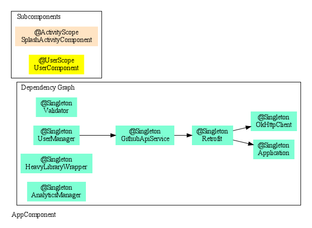
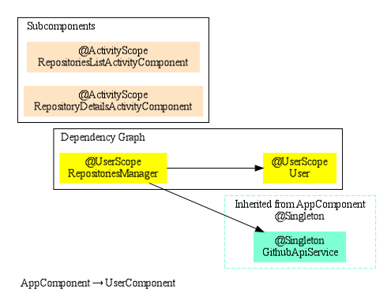
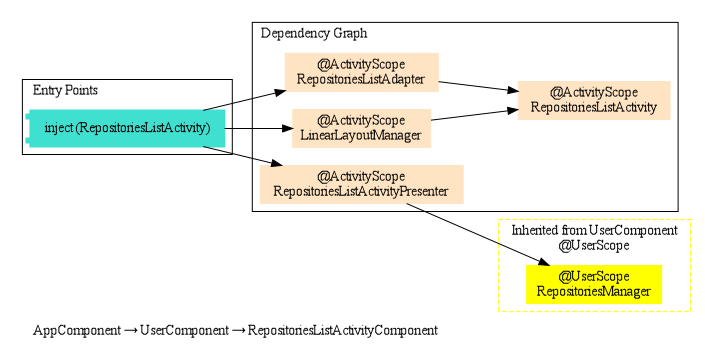
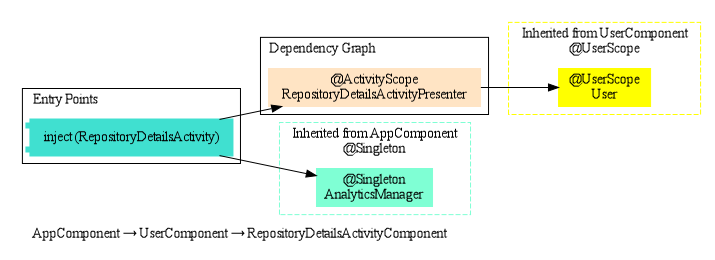
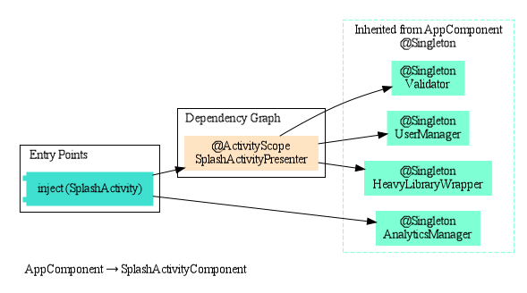
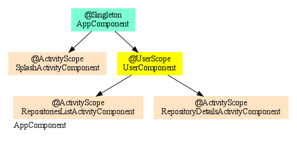

# GithubClient
Example of Github API client implemented on top of Dagger 2 DI framework. 

This code was created as an example for Dependency Injection with Dagger 2 series on my dev-blog:

- [Introdution to Dependency Injection](http://frogermcs.github.io/dependency-injection-with-dagger-2-introdution-to-di/)
- [Dagger 2 API](http://frogermcs.github.io/dependency-injection-with-dagger-2-the-api/)
- [Dagger 2 - custom scopes](http://frogermcs.github.io/dependency-injection-with-dagger-2-custom-scopes/)
- [Dagger 2 - graph creation performance](http://frogermcs.github.io/dagger-graph-creation-performance/)
- [Dependency injection with Dagger 2 - Producers](http://frogermcs.github.io/dependency-injection-with-dagger-2-producers/)
- [Inject everything - ViewHolder and Dagger 2 (with Multibinding and AutoFactory example)](http://frogermcs.github.io/inject-everything-viewholder-and-dagger-2-example/)
 
This code was originally prepared for my presentation at Google I/O Extended 2015 in Tech Space Cracow. http://www.meetup.com/GDG-Krakow/events/221822600/

# Update to AndrodX and Add DI Graph
1. Update the whole project dependency. Update to androidx
2. Get rid of 'com.google.auto.factory' to fix the build problem.
3. add kotlin-kapt for supporting scabbard, otherwirs, scabbard won't work.

